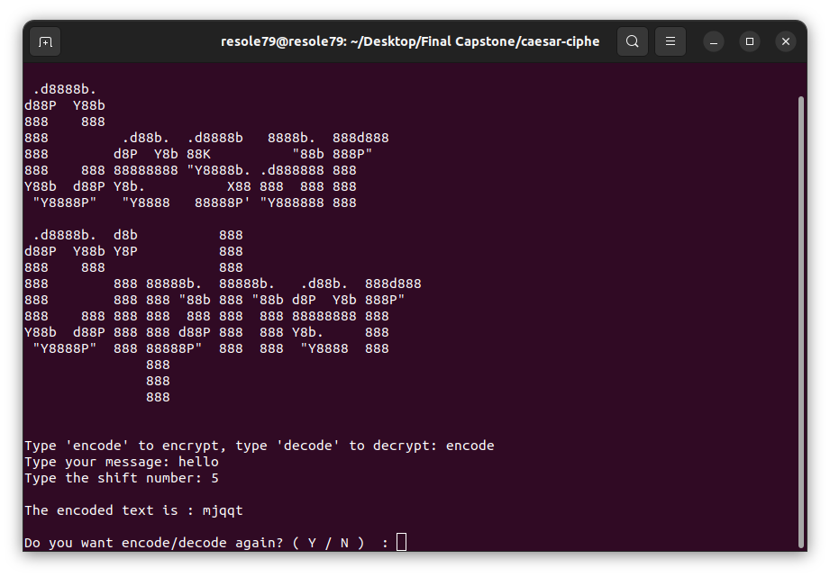

## Caesar Cipher

Program to generate Caesar Cipher.       
A Caesar cipher is a simple method of encoding messages.          
Caesar ciphers use a substitution method where letters in the alphabet are shifted by some fixed number.     
A Caesar cipher with a shift of 1 would encode an A as a B, an M as an N, and a Z as an A.      


###### It's a part of the **#100DaysOfCode** challenge by *Angela Yu*. ######    


#### Prerequisites
You will need the following software to run the Caesar Cipher:
 - [Python 3](https://www.python.org/downloads/)

#### Installation
To get started with the **Caesar Cipher**, follow these steps:

1. **Clone** the repository:

```sh
git clone https://github.com/resole79/caesar_cipher.git
```

2. **Run** the **caesar_cipher.py** file:

```sh
python caesar_cipher.py
```

#### File Structure   
 - **caesar_cipher.py**: Main program.
 - **art.py**: File contains the draws


#### **Usage**

```
 .d8888b.                                         
d88P  Y88b                                        
888    888                                        
888         .d88b.  .d8888b   8888b.  888d888     
888        d8P  Y8b 88K          "88b 888P"       
888    888 88888888 "Y8888b. .d888888 888         
Y88b  d88P Y8b.          X88 888  888 888         
 "Y8888P"   "Y8888   88888P' "Y888888 888         
                                                                                           
 .d8888b.  d8b          888                       
d88P  Y88b Y8P          888                       
888    888              888                       
888        888 88888b.  88888b.   .d88b.  888d888 
888        888 888 "88b 888 "88b d8P  Y8b 888P"   
888    888 888 888  888 888  888 88888888 888     
Y88b  d88P 888 888 d88P 888  888 Y8b.     888     
 "Y8888P"  888 88888P"  888  888  "Y8888  888     
               888                                
               888                                
               888                                   
```

Ask the user to input:
 - Type 'encode' to encrypt, type 'decode' to decrypt
 - Type your message
 - Type the shift number




## **Credit**

Author : Emilio Reforgiato (resole79)

##
<p align="right"><a href="https://www.linkedin.com/in/emilio-reforgiato/" target=”_blank” ></a></p>

 
